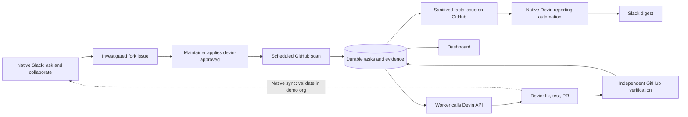

# Product requirements document — Devin Repair Desk

Version 2.0 · Owner: Yun · Updated 16 September 2026 · Native Slack design

Status: implementation specification. This document defines intended behavior; it does not claim that features or results already exist.

## 1. Executive proposition

Devin Repair Desk demonstrates adoption of Devin by a team maintaining Apache Superset. Engineers use Devin's native Slack app for questions and collaboration. For repeatable repairs, an authorized maintainer labels a verified fork issue; a scheduled application worker discovers it and creates a bounded Devin API session. The application tracks progress, independently verifies PR evidence, and supplies a polished dashboard. Native Devin sessions and automations provide Slack communication.

The presentation addresses a Superset engineering team as a simulated customer; it does not imply Apache has commissioned or adopted this system. The first customer scenario is a team maintaining an Apache Superset deployment. The pilot uses a public Superset fork as that team's repository. The product focuses on **small application bugs with a clear regression test**, because these require code understanding and changes while still offering a concrete way to judge success.

The commercial hypothesis is that autonomous implementation can reduce the engineering attention needed to move suitable backlog items into review. The take-home will measure execution, review readiness, intervention, and usage. It will not claim measured labor savings without a human baseline.

## 2. What the simulation means

Yun plays the forward deployed engineer working with a hypothetical customer engineering team. The Superset fork stands in for the customer's codebase, a dedicated Slack workspace stands in for their collaboration environment, and selected real defects stand in for their maintenance backlog.

The system should genuinely execute the integration and produce real fixes. Separately, its local simulation mode lets a reviewer exercise the same orchestration logic using fake external services without providing credentials or spending credits. These are two different meanings of simulation:

| Concept | What is simulated | What is real |
| --- | --- | --- |
| Customer engagement | The organization, backlog priorities, and adoption scenario | Superset code, selected defects, Devin work, PRs, checks, Slack integration |
| Application simulation mode | GitHub, Devin responses and clock progression | Request handling, policy rules, stored state, monitoring transitions, reports UI |

No invented production incident, customer usage, security finding, or savings estimate should be presented as observed evidence.

## 3. Problem definition

An engineer often needs to reconstruct context, locate a code path, reproduce an issue, implement a change, add tests, and package the result for review. Small defects can wait because this whole sequence competes with planned development. A leader also lacks a consolidated view of which delegated fixes are progressing, blocked, or ready for review.

The pilot addresses this specific problem:

> How can a Superset engineering team adopt Devin through familiar Slack conversations, automate approved backlog repairs, and know whether the resulting fixes are correct, reviewable, and worth the cost?

The first release starts after a candidate has been investigated. Automatically finding every bug is outside this release.

## 4. Users and jobs

| User | Job | What the product must provide |
| --- | --- | --- |
| Engineer requesting work | Use a familiar collaboration tool and delegate approved defects | Native Slack conversations, GitHub approval label, session link, progress |
| Senior engineer reviewing work | Determine whether a change addresses the issue and is safe to review | Reproduction, diff, regression test, exact commit checked, limitations |
| VP Engineering | Understand whether the pilot produces useful outcomes | Counts, progress, usage, blockers, review bottlenecks, evidence links |
| Integration operator | Keep automation controlled and recover from failures | Allowed identities/repositories, durable jobs, deduplication, pause/stop, audit history |

## 5. Scope and priority

### Required pilot capabilities

1. Own public automation repository, Docker packaging, setup documentation, and credential-free simulation.
2. Own Superset fork/copy with independently investigated issues and real Devin remediation attempts.
3. A scheduled scan of approved GitHub issues triggering the application's Devin API integration.
4. Durable session tracking, clarification and stop actions, bounded usage, and failure handling.
5. Real PR output with code and regression-test evidence.
6. A polished dashboard showing active work, verified outcomes, costs, and audit details.
7. Native Slack collaboration and completion summaries; native scheduled/on-demand reporting using an explicit published facts source.
8. Evidence of purposeful DeepWiki, Knowledge, Playbook, and environment setup.
9. A Loom under five minutes covering What, How, Why, and When.

### Deliberately deferred

Custom Slack apps/commands, custom Slack webhook handlers, Sentry ingestion/MCP, automatic upstream issue harvesting, multi-repository routing, SSO, organization-wide permissions UI, production deployment, automated merging, arbitrary Slack conversation forwarding, multi-agent fan-out, and automatic Playbook/Knowledge mutation.

Devin already offers native automations and integrations. This project builds a focused API integration to demonstrate customer-specific acceptance rules, correlated evidence, reporting, and a reproducible evaluation environment. A real engagement should evaluate native capabilities before adding custom components. [Devin Automations](https://docs.devin.ai/product-guides/automations)

## 6. Issue selection policy

Select a small group of related bugs that can share an execution environment and test approach. Prefer a localized backend behavior or frontend utility/component over a broad application redesign. An upstream report is a candidate, not proof that the fork still has the defect.

Each selected issue must contain:

- Link to its upstream source, if any, and attribution.
- Fork repository and recorded baseline commit.
- Expected behavior and observed behavior.
- Minimal reproduction with inputs and output.
- Proposed acceptance criteria, including a regression test.
- Initial code/test leads, with uncertainty clearly marked.
- Explicit exclusions, such as no dependency overhaul or unrelated refactor.

Create issues on the fork, never on Apache's repository for the purposes of this demo. Do not introduce a defect simply to create work. A genuine missing test can be a code-quality issue, but represent it as test coverage rather than a repaired functional bug.

Target three issues for the pilot. This is a project choice, not a requirement in the assignment. Smaller, independently verified successes are better evidence than an inflated count of unverified PRs.

## 7. Core user journey

1. Demonstrate a codebase question through the native Devin Slack app. An investigation may supply leads, but is not permitted to implement a repair being delegated through the application.
2. Verify a defect on the fork and create a work order with acceptance criteria.
3. An allowed GitHub maintainer applies `devin-approved`. The application scans the configured fork every 60 seconds; a periodic trigger is explicitly permitted by the assignment.
4. The scanner retrieves issue and label-event evidence, checks the approval actor, snapshots the issue, and durably creates one task. Repeated scans do not repeat work.
5. The worker reserves usage and creates a Devin API session with the task's Playbook, Knowledge, and output contract.
6. Use native Slack sync for that same session after validating the actual organization's behavior. If a manual UI attachment is needed, record that operator step. Do not claim undocumented automatic API-to-Slack routing.
7. Devin investigates, implements, tests, and opens a fork PR. Engineers communicate in the native conversation; they can use the linked Devin session if sync is unavailable.
8. The application polls session state and verifies the PR/current head against expected checks. The dashboard distinguishes agent output, independent validation, and review.
9. The application supplies the verified outcome to the existing session through the API, as an explicitly budgeted message. Ask Devin to summarize that supplied evidence in its connected conversation. Capture actual delivery before claiming native Slack publication.
10. For organization reporting, the application publishes sanitized metrics into one configured GitHub issue in the automation repo. A native Devin reporting automation reads that source and posts the daily digest. An on-demand native Slack request reads the same source.
11. A human reviews and merges. The operator manages session cleanup without abruptly ending the native conversation.



## 8. Functional requirements

| ID | Requirement | Acceptance test |
| --- | --- | --- |
| F01 | Use native Slack for the adoption experience | A linked user asks a real codebase question and receives a useful answer |
| F02 | Admit only approved issues on the configured fork | Unapproved, closed, wrong-repo, PR objects, or disallowed-actor inputs create no session |
| F03 | Run a periodic issue scanner | Applying a valid label leads to durable intake on a subsequent scan |
| F04 | Deduplicate scans and attempts | Repeated discovery and concurrent claims preserve one task; retries require explicit operator action |
| F05 | Create bounded sessions through the application's API client | Context versions, cap, session ID/URL and approval evidence are recorded |
| F06 | Monitor session details honestly | Working, input/approval, finished, suspended, failed, and unknown states are distinguished |
| F07 | Support human collaboration using native surfaces | A reply reaches the same repair session; manual attachment is disclosed if needed |
| F08 | Provide operator pause, API message, and stop functions | Actions are audited; uncertain results stay uncertain; termination is documented |
| F09 | Independently verify PR evidence | Wrong repository, missing/failed or stale checks never produce verified |
| F10 | Recover after restart | Existing sessions are reattached, not recreated |
| F11 | Publish an accurate facts snapshot | Only the configured report issue is updated with sanitized, timestamped, hashed data |
| F12 | Demonstrate native daily and on-demand reports | Reports read the intended snapshot, identify its freshness, and post to the configured demo channel |
| F13 | Render polished dashboard from real backend data | No fake live counts; explicit managed/native session scope and missing data |
| F14 | Provide credential-free simulation | Fake GitHub/Devin clients exercise shared scanner, worker, verifier and snapshot logic |
| F15 | Document operation and native integration boundaries | A reviewer can run simulation and understand which live steps need account configuration |

## 9. Native Slack and approval boundaries

There is no custom Slack app, bot token, signing secret, command handler, or Slack message relay in the application. Engineers use the official Devin Slack app and their linked Devin identities. Native conversation is the short adoption demonstration, rather than the custom engineering centerpiece. [Native Slack](https://docs.devin.ai/integrations/slack)

Use `devin-candidate` to mark a reproduced candidate and `devin-approved` to authorize application dispatch. Inspect the latest relevant label event's actor against `GITHUB_ALLOWED_APPROVERS`; an issue author or free-text claim is not approval. Retrieve the issue events and current labels with pagination. Freeze accepted issue content; if it changes before dispatch, pause for review. Removing approval before dispatch prevents creation; removing it afterward does not itself stop an existing session. [GitHub issue events](https://docs.github.com/en/rest/issues/events)

Keep one persisted task per selected issue. Reapplying the label or rescanning a failed task does not silently spend on a new attempt. An operator-authorized retry records its reason and reconciles existing sessions/PRs first. Normal discovery latency includes the scan interval and API processing time; failures can delay it further. This periodic trigger does not promise immediate or lossless webhook delivery.

### API-created session to native Slack: explicit feasibility gate

Test a small API-created session in the actual demo org: open it, enable Slack sync through available UI, verify replies in both directions, and test whether future API-created sessions inherit the route. Record the exact result. The API reference does not document a Slack channel/thread creation field; `session_links` and an output `origin` field are not a substitute for such a contract. [Create Session](https://docs.devin.ai/api-reference/v3/sessions/post-organizations-sessions)

If only manual sync works, keep it as a disclosed pilot operator step. If sync is unavailable for those sessions, show native Slack onboarding and native reports separately; repair collaboration uses the linked Devin UI. Do not replace native Slack with a custom bot as an unannounced fallback. This integration limitation does not remove the working API remediation requirement.

Direct `@Devin` sessions and native automations can start outside the custom service. Mark them as native/unmanaged unless deliberately imported for observation. The custom queue's budget/concurrency policy is not an organization-wide guardrail.

## 10. Devin's role and context design

The core runtime depends on Devin's autonomous work: it must inspect an unfamiliar code path, test a hypothesis, edit code, run commands, adapt to feedback, and create a reviewable artifact. Ordinary application code handles known rules and bookkeeping.

| Mechanism | Pilot use | Evidence to retain |
| --- | --- | --- |
| DeepWiki and Ask Devin | Understand the relevant Superset area and identify code/test leads before selecting a task | A useful question, source-linked answer, and verified finding |
| Execution environment | Prepare the dependencies and services required by the chosen tests | Successful environment build and a passing baseline smoke check |
| Knowledge | Store concise, verified facts about the pilot repository and validation setup | Note IDs, text copies, applicability, and a verified lesson |
| Remediation Playbook | Reusable procedure for reproduction, fix, regression, checks, and PR delivery | Versioned file and recorded Playbook ID/hash per run |
| Per-session input | Issue snapshot, acceptance criteria, base commit, task ID, output schema | Sanitized request record |
| Structured output | Machine-readable account of what Devin did and where evidence can be found | Schema validation and raw result retained separately from verified facts |
| Reporting Playbook | Explain a sanitized factual snapshot in concise language for engineers and leaders | Report session URL, factual snapshot hash, generated interpretation |

DeepWiki exploration in the UI is not assumed to automatically carry into an API-created session. Copy the relevant verified findings into the issue/task input or a scoped Knowledge note. Repository wikis and Ask Devin provide source-oriented exploration. [DeepWiki](https://docs.devin.ai/work-with-devin/deepwiki), [Ask Devin](https://docs.devin.ai/work-with-devin/ask-devin)

The API supports session context through `playbook_id`, `knowledge_ids`, `repos`, and structured output fields, together with `max_acu_limit`. Verify values and repository identifiers in the actual organization during the first integration test. Do not set approval bypass or user impersonation for this pilot. [Create session](https://docs.devin.ai/api-reference/v3/sessions/post-organizations-sessions)

## 11. Technical architecture

Use Python/FastAPI for the API and orchestration, SQLite for durable state, and React/TypeScript with a small component and chart library for the UI. Build the frontend in Docker and serve its compiled assets from FastAPI.

For the pilot, run **one application process and one background worker loop**. The loop scans approved issues, claims persisted jobs, dispatches eligible sessions, polls existing work, performs verification, and publishes due facts snapshots. Native Devin owns report generation and its daily schedule. External requests must be asynchronous and have timeouts. SQLite provides a restartable job table; an in-memory background task is not the job system.

One process with a persistent local volume is a deliberate four-day tradeoff. A scaled production system would use a shared database and separately supervised workers. Adding multiple web workers without redesigning job ownership is unsupported.

### Recommended structure

```text
devin-repair-desk/
  app/
    main.py
    config.py
    db.py
    models.py
    cli.py
    routes/dashboard.py
    clients/devin.py
    clients/github.py
    clients/fakes.py
    services/scanner.py
    services/policy.py
    services/worker.py
    services/dispatch.py
    services/monitor.py
    services/verification.py
    services/reporting.py
    services/report_source.py
  frontend/
  playbooks/
  knowledge/
  schemas/
  config/verification.yaml
  fixtures/
  tests/
  docs/
  Dockerfile
  compose.yaml
  .env.example
  .gitignore
  .dockerignore
  README.md
```

### Internal API

| Route | Purpose |
| --- | --- |
| `GET /healthz` | Minimal service health; expose no secrets or data |
| `GET /api/overview` | Mode, freshness, metrics, operating limits |
| `GET /api/tasks` | Filtered, paginated task list |
| `GET /api/tasks/{id}` | Task, attempts, evidence, audit timeline |
| `GET /api/reports` | Snapshot/publication history and observed native report links |
| `GET /api/reports/{id}` | Facts snapshot, publication state, and observed native-report links |
| `POST /api/simulation/scenarios` | Start a named deterministic fixture; simulation mode only |

Keep the dashboard local and read-only in live mode at 127.0.0.1:8000. Perform operator mutations through the local CLI. GitHub polling and API calls are outbound, so this version needs no public tunnel or inbound webhook. The report-source issue is the deliberately published bridge to native reporting, not a public endpoint into your laptop.

## 12. Persistence and state

### Records

| Record | Essential fields |
| --- | --- |
| Approval receipt | Internal ID, repository/issue, GitHub label event ID, actor, observed time, issue snapshot/hash, processing state |
| Task | ID, mode, issue URL/number/repository, issue snapshot/hash, accepted time, approval actor, optional native Slack link, disposition |
| Attempt | Task ID, attempt number, creation correlation tag, base SHA, session ID/URL, raw status/detail, last seen, ACU cap/usage, prompt/context hashes |
| Job | Kind, due time, claimed time, lease expiry, attempt count, last error, status |
| Evidence | PR URL/base/head SHA, expected checks, check source/name/result/SHA/link, agent report, verifier timestamp |
| Audit event | Task ID, time, actor/source, action, old/new value, safe detail |
| Publication | Snapshot hash, fixed GitHub report issue, revision/observed body, confirmed/unknown/failed state |
| Report | Type, period/timezone, snapshot hash, native session URL when observed, native generation state, optional confirmed Slack link; unknown delivery stays unknown |

Store timestamps in UTC and render in the configured timezone. Keep live and simulated data in separate database files/volumes, and attach mode to every response and exported result.

### Keep execution, validation, and review separate

Do not compress the whole task into one green success label.

| Dimension | Example states |
| --- | --- |
| Execution | queued, dispatching, creation_unknown, working, needs_input, approval_required, agent_finished, suspended, failed, stop_requested, stopped |
| Validation | no_pr, pr_found, checks_pending, checks_failed, verified, unknown |
| Review | awaiting_review, changes_requested, approved, merged, closed_unmerged, unknown |
| Disposition | active, delivered, blocked, failed, cancelled |

The summary badge derives from these dimensions. A task can have an agent-finished execution and failed checks. It can also have a verified PR awaiting human review.

Provider `status_detail` matters: a running session can be waiting for input, awaiting approval, or finished. Preserve unfamiliar values and display uncertainty instead of treating them as success. [Get session](https://docs.devin.ai/api-reference/v3/sessions/get-organizations-session)

### Dispatch and retry rules

Persist a creation intent with a stable task/attempt tag before calling Devin. If a session ID is returned, store it before any follow-up communication. A connection timeout after submission is ambiguous: the session may exist. Mark creation as unknown, search the organization's sessions for the correlation tag, and reattach only when there is an unambiguous match. Paginate reconciliation results. If uncertainty remains, require operator resolution before any new attempt.

Local scan deduplication does not guarantee exactly-once external creation. Use a unique approval receipt, a transactional active-issue constraint, a durable creation intent, and reconciliation to reduce duplication. Do not claim an undocumented provider idempotency guarantee.

Retry read-only requests with bounded exponential backoff and jitter, honoring `Retry-After`. Distinguish definitive rejection from uncertain network outcomes for writes. Do not blindly resend an uncertain session message or stop operation. For an uncertain update of the fixed report-source issue, read back its snapshot hash before deciding whether another identical update is necessary. Persist a delivery state and reconcile where possible; otherwise surface delivery uncertainty.

### Session handoff and finalization

Keep a completed repair session available through the planned Slack discussion and validation summary; do not automatically terminate it immediately after PR verification. Native replies may resume work and consume additional usage outside dispatcher admission. Explain this boundary and use provider-level permissions and caps as available.

For a strictly serial pilot, capture the result and conversation, then explicitly stop/archive the computing session through the operator CLI before dispatching the next repair. Persist evidence first, use the documented `archive=true` termination option, and confirm the result. Termination is permanent; it differs from a native sleep/archive workflow that may permit resumption. Preserve a delivered task's outcome when cleaning up its session. [Terminate Session](https://docs.devin.ai/api-reference/v3/sessions/delete-organizations-sessions)

A validation-summary API message is an authorized follow-up, not a free notification: check current session state, remaining cap and dispatch capacity before sending it, avoid duplicate messages, and never resume a deliberately stopped or budget-blocked task automatically. If it cannot be sent, the dashboard remains authoritative and the limitation is visible.

## 13. Verification policy

An agent's structured result is useful testimony. The application must independently fetch the PR, confirm it belongs to the allowed fork and intended base branch, read its current head SHA, and retrieve checks for that SHA.

Define the expected check names per selected issue before dispatch. Require successful results from the expected trusted workflow source; do not accept any arbitrary green check with a similar name. Missing, skipped, cancelled, or neutral checks are not equivalent to a passing regression test. Re-fetch the head before marking verified; a new push invalidates earlier verification.

For this pilot, prefer a small GitHub Actions workflow running the chosen focused tests. Do not depend on all upstream Superset workflows being usable in the fork. If CI cannot run, retain a reproducible independent validation transcript tied to the commit and label the outcome **manually verified**, not CI verified. The UI and final report must expose which method was used.

A strong regression demonstration shows the new test detecting the original behavior and passing with the fix. Because the test may not exist on the base commit, use a clean base checkout with only the new regression test applied. Confirm that the failure is the expected assertion, not an import/setup failure. Record the commands, exit results, base SHA, and PR SHA.

Do not automatically merge or close issues. Human review can merge a successfully validated PR and close the associated fork issue afterward. Preserve unmerged PRs if they provide clearer evaluation evidence.

## 14. Dashboard requirements

### Overview

Use a clean, restrained interface with a visible LIVE/SIMULATION badge, repository name, last successful refresh, and a clear health/paused state. A row of compact metrics should show active tasks, needs-input tasks, verified PRs, merged PRs, and observed ACUs. Display denominators or counts when claiming rates.

The main table contains issue/title, requester, execution state, validation state, review state, elapsed time, ACUs, and links. Support filtering by state and a useful empty state. Charts are optional: a small status distribution is useful; a trend chart with fabricated history is not.

### Task detail drawer

Show the original issue and acceptance criteria; Slack, Devin, and PR links; the base and tested head commits; Playbook/Knowledge versions; agent-reported checks; independently retrieved checks; usage; and a timestamped audit timeline. Highlight the latest question or blocker and link to the same session's native Slack conversation when verified, otherwise to Devin's UI.

### Reports view

Show published facts snapshots, coverage/freshness, publication state, and observed native report sessions/Slack links. Do not infer Slack delivery from a finished session or equate an intended channel with confirmed posting. The native report itself is reviewed in Slack; native report monitoring is read-only and may require manually recording a link.

### Quality bar

Readable at laptop resolution and 125% browser zoom; consistent spacing and typography; keyboard-accessible controls; state represented by text as well as color; loading/error/empty states; no inaccessible API keys in frontend code. A failed refresh preserves old data with a stale indicator rather than replacing it with zeros.

## 15. Metrics and business interpretation

| Metric | Definition and limits |
| --- | --- |
| Accepted tasks | Distinct eligible tasks accepted within the selected interval |
| Active work | Current non-terminal work as of the report snapshot; may have been accepted earlier |
| Verified deliveries | Distinct tasks first independently verified during the interval |
| Merged PRs | PRs observed merged during the interval; human adoption outcome |
| Needs intervention | Current blocked/input/approval tasks, with actionable reasons |
| Time to first PR | First observed PR time minus task acceptance time; approximate observation-based latency |
| Time to verification | Verification time minus acceptance time; report sample size |
| Intervention count | Audited operator actions plus observable or manually recorded native clarifications; disclose incomplete native conversation coverage |
| Observed ACUs | Latest provider-reported cumulative usage per session, summed once; missing usage remains unknown |
| ACUs per verified task | Clearly identified cohort's remediation ACUs divided by its verified tasks; unavailable when denominator is zero or usage incomplete |

Track remediation, setup/discovery, and reporting usage separately where observable. Do not sum repeated cumulative polls. Do not label lifetime session usage as daily usage: daily consumption requires timestamped usage deltas or an authoritative consumption source. If only cumulative values are available, label the card **cumulative ACUs for included sessions**.

For a three-task sample, report counts and individual durations. Do not infer statistical reliability or compare heterogeneous tasks as proof that a Knowledge edit reduced costs. Business impact is a hypothesis supported by pilot evidence and an explicit plan to measure a baseline.

## 16. Native reporting with an explicit data source

The application computes deterministic snapshots for today-to-date, the previous local calendar day, and the rolling last seven days, with UTC boundaries, chosen timezone, generation time, per-task evidence and unknown fields. Publish these into the body of one pre-created GitHub issue in the automation repository, named `Repair Desk report data (generated)`. Each update includes a stable schema version and content hash.

Use a separate GitHub credential scoped to that repo with Issues write permission. Client code fixes the one target issue; GitHub's credential grants repository-level permission, not issue-level isolation. Never let issue content choose the write destination. Persist history locally and publish at most once per configured interval or meaningful change. Read back ambiguous updates. Publish only sanitized demo data; a customer deployment would use an appropriately private data source. [GitHub issue API](https://docs.github.com/en/rest/issues/issues)

Configure a native Devin scheduled automation to read that source and post to `#engineering-digest` at 09:00 in the intended timezone, covering the previous day. Give it the reporting Playbook/procedure, narrow access, an ACU cap, invocation limits, and report tags when supported. For an ad-hoc report, mention Devin in the reporting channel with the source URL and the exact requested window. Native schedules and Slack channel access are configured in Devin, not reimplemented by this application. [Devin Automations](https://docs.devin.ai/product-guides/automations)

Devin preserves the supplied metrics, distinguishes facts from recommendations, cites the source/hash and flags stale or missing data. The application does not claim that it can deterministically validate a message after a native automation sends it. Review the pilot's delivered text against the snapshot and record any discrepancies. A stronger production validation-before-send gate would need a separately designed approval/tool boundary.

Native reporting must have real read access to the source repository through the configured GitHub integration and posting access to the channel. Prove this with a bounded test. No assumption that the agent can see the application's local SQLite database.

Native completion summaries come from the repair conversation; any later independent verification is supplied to the session as a factual update when permitted. Reporting failure never changes remediation outcome. The source snapshot remains readable if generation or delivery fails.

The local application must run to refresh snapshots; a native scheduled report may still run when the laptop is off and must explicitly flag stale data. Native-report costs and direct Slack sessions have separate provider controls. Observe/tag their usage where available, display missing coverage, and never claim the application's admission budget governs them.

## 17. Enterprise concerns proportionate to the pilot

| Concern | Implement now | Production extension |
| --- | --- | --- |
| Authorization | Native linked identities, GitHub approval actor checks, fixed repository | Customer SSO/groups and aligned native/API roles |
| Credentials | Server-side environment secrets, minimal service permissions, redacted logs | Managed secrets, rotation, identity federation where supported |
| Code trust | Treat issues/comments as task data; approved context and PR review | Stronger execution/network policy and customer-specific guardrails |
| Change control | PR-only delivery, trusted checks, explicit human merge | Protected branches and formal approval policy |
| Spending | API-managed caps/reservations and local pause; native automation caps configured separately | Organization-wide consumption reconciliation and quota policies |
| Reliability | Durable jobs, deduplication, reconciliation, restart recovery | Shared database, queue, separate workers, service objectives |
| Traceability | Actor-to-issue-to-session-to-PR-to-check trail | Export to customer audit/SIEM systems |
| Privacy | Demo-only public code/data, no broad Slack ingestion | Retention agreements, deletion/export controls, data residency review |

Application allowlists prevent the orchestrator from dispatching arbitrary repositories; they do not independently constrain every action available inside Devin. Configure the Git integration to the pilot repositories where possible. Prompt instructions and Knowledge are guidance, while actual permissions and code checks provide enforcement.

Use a Devin service user for shared automation and select the smallest available role that supports the required operations. [Authentication](https://docs.devin.ai/api-reference/authentication)

Application usage limits are admission controls, not an exact invoice guarantee. Reserve the full session cap before creation, keep unknown creations reserved, and account for API follow-ups too. Native report/direct Slack spend must be monitored separately. Review actual organization consumption during the pilot.

## 18. Docker and simulation

Docker is required by the assignment and gives reviewers a consistent runtime. It packages the automation application and UI; Devin runs its own coding environment. A local persistent volume preserves application state. The container should run as a non-root user, use locked dependencies, and exclude secrets and local data from its image.

Simulation replaces all external clients and uses deterministic events through the same services. It must never fall back to a live client if configuration is missing. Use a separate volume and visible mode indicators. The simulator should demonstrate happy path, blocked agent, failed checks, duplicate scan, uncertain creation, provider throttling, restart recovery, and report failure.

This does not prove actual Slack delivery, authentication permissions, Devin capability, GitHub access, or real code correctness. Those require the live evidence pack.

## 19. Delivery gates

| Gate | Evidence required before moving on |
| --- | --- |
| G1: Suitable task | A defect reproduced on the recorded fork baseline and a feasible focused validation route |
| G2: Devin readiness | Environment smoke test passes; one bounded real session can work on the fork |
| G3: Product skeleton | Docker simulation performs intake through outcome using persisted state |
| G4: Real integration | Periodic scan discovers an approved issue and code creates a recorded Devin API session |
| G5: Actual remediation | Real PR, relevant diff/test, independently verified evidence, honest limitations |
| G6: Operational demonstration | Dashboard, native collaboration boundary tested, published facts, native daily/ad-hoc reports, recovery tests |
| G7: Submission | Public repos, reproducible README, accessible Loom under five minutes, no secrets |

If behind schedule, remove charts, reaction triggers, Sentry, auto-discovery, and visual embellishment first. Preserve real remediation, session management, evidence, Docker, and the five-minute story.

## 20. Evaluation traceability

| Interview criterion | What the code demonstrates | What the video shows |
| --- | --- | --- |
| Translate ambiguity into a working system | Narrow issue eligibility, trusted approval, durable state, defined acceptance tests | Explain chosen backlog scope and show approved issue discovery |
| Devin as a core primitive | Runtime API session creation/management, reusable context, code/test/PR delivery | Open the API-created session and show investigation, adaptation, and its resulting diff |
| Technical execution and business impact | Independent verification, intervention/usage metrics, reports and audit links | Distinguish reviewable output from merged value; explain who acts next |

## 21. Customer extension plan

Start a real engagement by identifying which backlog or incident queue consumes engineering attention, which repositories and tests are accessible, what constitutes acceptance, and who approves spending and merging. Establish a human baseline on comparable tasks.

Then pilot one team and one issue class. Expand only if the measured review quality, intervention rate, and cost justify it. Add Sentry when actual runtime events and permissions exist; its MCP integration supplies diagnostic context, while your event adapter still governs task intake. [Sentry integration](https://docs.devin.ai/enterprise/integrations/sentry), [Sentry remediation example](https://docs.devin.ai/use-cases/gallery/scheduled-sentry-remediation)

Evaluate Devin Review as a secondary signal after the main fix path is stable. Require human review of changes to reusable Knowledge. These are potential extensions inspired by official examples, not implemented pilot claims. [Review autofix example](https://docs.devin.ai/use-cases/gallery/devin-review-autofix), [Knowledge maintenance example](https://docs.devin.ai/use-cases/gallery/scheduled-knowledge-maintenance)
