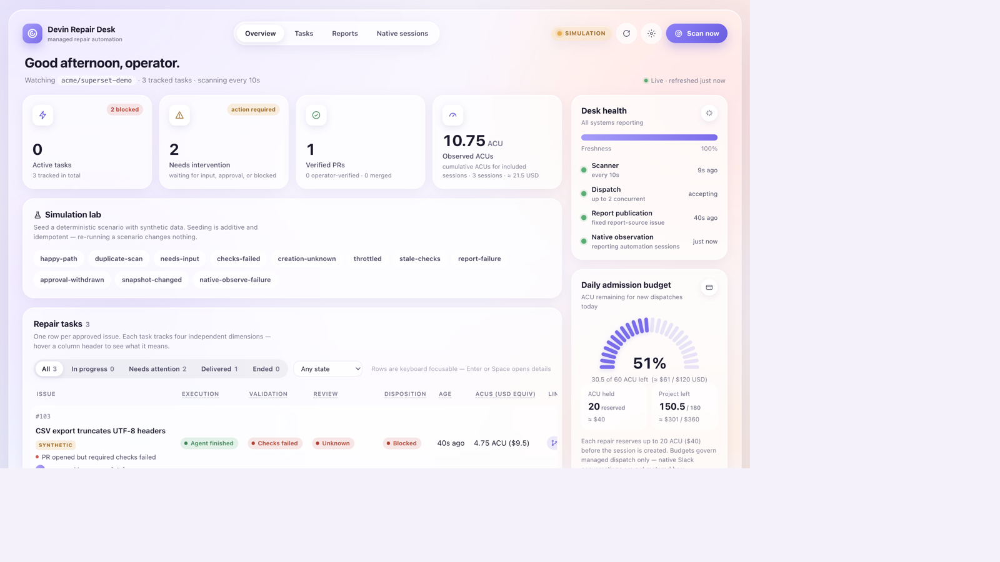
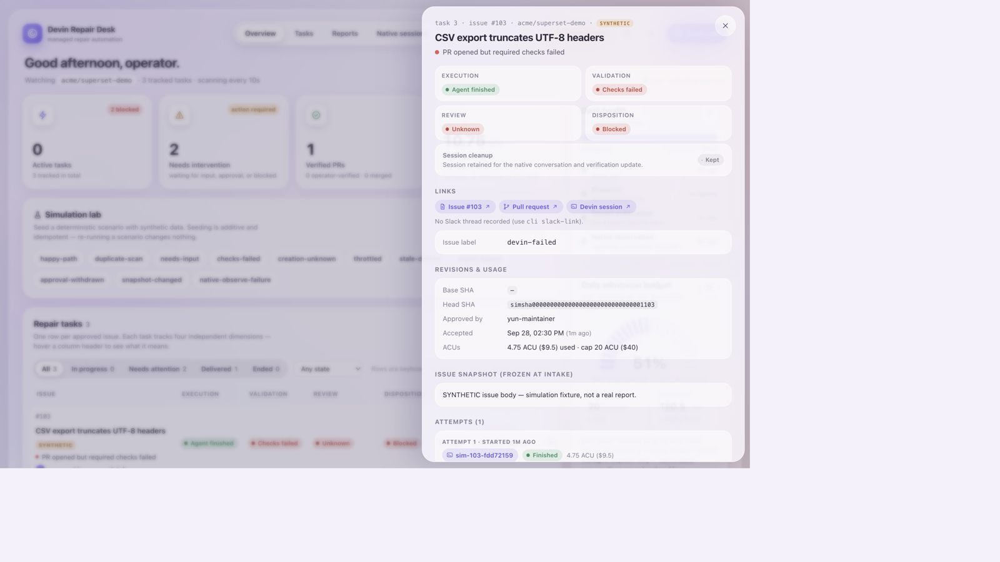
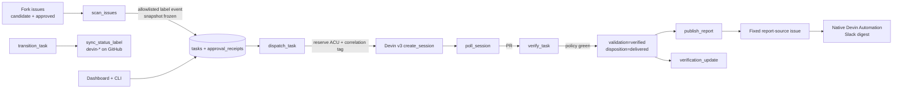

# Devin Repair Desk

**Problem.** Small, reproducible bugs on a maintained fork (here: Apache Superset) often wait because reconstructing context, fixing, testing, and packaging a PR competes with planned work. Leaders also lack a single place to see which delegated repairs are progressing, blocked, or ready for review.

**Who benefits.** A Superset-style engineering team that wants to adopt Devin through familiar Slack conversations, authorize repeatable repairs with a GitHub label, and know whether the resulting fixes are correct, reviewable, and within budget.

**What this repo is.** A local FastAPI + React **ops desk** that scans maintainer-approved issues on a configured fork, creates a **bounded Devin API session** per issue, tracks it through durable jobs, **independently verifies** PR checks against a versioned policy, mirrors status onto GitHub labels, publishes sanitized report facts for a native Devin Automation, and surfaces everything on a dashboard. Slack collaboration and daily digests stay on **Devin's native surfaces** — this app does not ship a custom Slack bot.

| Mode | Purpose |
| --- | --- |
| `APP_MODE=simulation` | Credential-free demo of the same orchestration (fake GitHub/Devin). |
| `APP_MODE=live` | Real fork + Devin org; fail-closed until fully configured. |

> Simulation proves the desk's logic. Live evidence (real sessions, PRs, checks) is what demonstrates Devin as a core primitive. Do not treat synthetic screenshots as live remediation proof.

---

## Screenshots

Simulation dashboard — mode badge, desk health, ACU admission budget, and tasks across happy-path / needs-input / checks-failed:



Task drawer — four state dimensions, managed status label (`devin-failed`), links, usage vs cap, frozen issue snapshot, attempts:



---

## Interview map

| Criterion | Where it shows up |
| --- | --- |
| Translate ambiguity into a working system | Eligibility + allowlisted approval, intake freeze, four state dimensions, durable jobs |
| Devin as a core primitive | Live v3 session create / poll / message / stop; playbook + knowledge IDs; real PR delivery |
| Technical execution & business impact | Independent verification vs agent claims; ACU reservations & admission caps; reports + audit |

Loom (≤5 min): _add link after recording_.

---

## Workflow labels

Human-controlled **authorization** labels (intake) are separate from desk-managed **status** labels (output). Status labels never authorize spend and are excluded from the frozen snapshot hash.

### Authorization (humans)

| Label | Meaning |
| --- | --- |
| `devin-candidate` | Issue is a reproduced candidate (discovery). Does **not** start a session. |
| `devin-approved` | An allowlisted maintainer authorized remediation. Required with a matching latest `labeled` event actor ∈ `GITHUB_ALLOWED_APPROVERS`. |

### Status (desk-managed)

| Label | When applied |
| --- | --- |
| `devin-in-progress` | Task accepted / session working / blocked waiting |
| `devin-pr-opened` | PR found or checks pending |
| `devin-succeeded` | Independently verified / delivered / merged-or-approved review |
| `devin-failed` | Session failed/stopped, required checks failed, or task failed/cancelled |

Create them once on the **fork** (adjust owner/repo):

```bash
REPO=YOUR_GITHUB_NAME/superset-demo

# Authorization
gh label create devin-candidate --repo "$REPO" --color C5DEF5 --description "Reproduced candidate for Repair Desk" --force
gh label create devin-approved  --repo "$REPO" --color 0E8A16 --description "Allowlisted maintainer authorized Devin remediation" --force

# Status (written by the desk; GITHUB_TOKEN needs Issues write)
gh label create devin-in-progress --repo "$REPO" --color FBCA04 --description "Repair Desk session in progress" --force
gh label create devin-pr-opened   --repo "$REPO" --color 6F42C1 --description "Remediation PR awaiting verification/review" --force
gh label create devin-succeeded   --repo "$REPO" --color 1D76DB --description "Independently verified or delivered" --force
gh label create devin-failed      --repo "$REPO" --color D73A4A --description "Session or required checks failed" --force
```

---

## Architecture

One process: FastAPI serves the dashboard API + built SPA and runs **one async worker** that claims durable SQLite jobs. Restarts reattach in-flight work — they never recreate sessions.



### Three automations, three owners

| | Managed repair (this app) | Native collaboration | Native reports (external) |
| --- | --- | --- | --- |
| What | scan → dispatch → poll → verify → publish | Slack thread on the repair session | Daily digest in Slack |
| Who runs it | This worker | Devin's Slack integration | A native Devin Automation you configure once |
| This app… | Owns it | Budgeted `message` / verification update; `slack-link` records the permalink | Publishes facts + **observes** tagged sessions; never infers Slack delivery |

More detail: [`docs/architecture.md`](docs/architecture.md) · native report setup: [`docs/native-reporting.md`](docs/native-reporting.md).

### State model (four dimensions)

Flat status would hide “agent finished but checks failed.” Each task tracks:

| Dimension | Examples |
| --- | --- |
| **execution** | queued → working → agent_finished / needs_input / failed / stopped |
| **validation** | no_pr → checks_pending → verified / checks_failed / manually_verified |
| **review** | awaiting_review → approved / changes_requested → merged / closed_unmerged — landed by the `watch_prs` poller on the scan cadence |
| **disposition** | active → delivered / blocked / failed / cancelled / deleted |

Plus a **cleanup** ledger (`kept` vs `terminated`) so retaining a session for Slack/verification update does not tangle with outcome.

---

## Observability

| Signal | Where |
| --- | --- |
| Mode (`SIMULATION` / `LIVE`), pause, scan/report/native-obs freshness | Dashboard header badges |
| Desk health (scanner, dispatch, report publish, native observe) | Sidebar |
| Metrics: active, needs intervention, verified / manual / merged PRs, observed ACUs | Hero cards |
| ACU held + daily/project admission remaining | Budget gauge |
| Per-task execution/validation/review/disposition + plain-language headline | Task table |
| Agent assertions vs `github-verifier` facts vs `manually_verified` | Task drawer evidence groups |
| Audit timeline | Task drawer |
| Report snapshots + publication status | Reports panel |
| Native report sessions (read-only) | Native sessions panel |
| JSON evidence export | `python -m app.cli export-evidence` |
| Config preflight (no secrets printed) | `python -m app.cli doctor` |

API: `GET /healthz`, `/api/overview`, `/api/tasks`, `/api/tasks/{id}`, `/api/reports`, `/api/native-sessions`, `/api/jobs`, `/api/control`.

---

## Credentials and initial setup

### 1. Connect the repository to Devin

1. In Devin, connect GitHub and grant the integration access to your **Superset fork** (e.g. `YOUR_GITHUB_NAME/superset-demo`).
2. Confirm Devin can clone, push branches, and open PRs on that fork.
3. Prepare an execution environment / blueprint that can install deps and run your focused tests (see Devin environment docs). DeepWiki / Ask Devin can help investigate; copy verified findings into the issue or Knowledge — UI exploration does not automatically attach to API sessions.

### 2. Create the Devin service user and API key

1. Devin → **Settings → Devin API → Service users** (or Settings → Service users).
2. Provision a user such as `repair-desk` with the **Member** role (or a custom role that can create, read, message, and terminate sessions — creation needs `UseDevinSessions`).
3. Copy the API key (`cog_…`) once; store it only in local `.env`.
4. Copy the **organization ID** from the same settings page → `DEVIN_ORG_ID`.

Do not use a personal chat key as the automation identity. Prefer the smallest role that works. [Authentication](https://docs.devin.ai/api-reference/authentication) · [Teams quickstart](https://docs.devin.ai/api-reference/getting-started/teams-quickstart)

### 3. Set up GitHub repositories

You need **two** repos under your pilot org/account:

| Repo | Role |
| --- | --- |
| Automation (this repo) | App, Docker, tests, docs, report-source issue |
| Superset fork | Issues + PRs only — never open pilot issues on `apache/superset` |

On the fork: create the labels above, pick a recorded baseline commit, and write issues with expected/observed behavior, reproduction, acceptance criteria (incl. regression test), and exclusions.

### 4. Create GitHub PATs

**A. Application token → `GITHUB_TOKEN`** (fine-grained, fork only)

| Permission | Why |
| --- | --- |
| Issues: Read and write | Read issues/events; apply managed `devin-*` status labels |
| Pull requests: Read | Track remediation PRs |
| Contents: Read | SHAs / context as needed |
| Checks / Actions (as required) | Independent verification of check-runs |
| Metadata: Read | Usually automatic |

No code-write or merge permission. Do **not** reuse Devin's GitHub connection credential as this token.

**B. Report token → `REPORT_GITHUB_TOKEN`** (fine-grained, automation repo only)

- Issues: Read and write on the automation repo only.
- Create one issue titled **Repair Desk report data (generated)**; set `REPORT_GITHUB_REPO` + `REPORT_DATA_ISSUE_NUMBER`.
- The app updates **that one issue body** in place (never unbounded comments). Destination is config-fixed and re-validated each publish.

### 5. Knowledge and Playbooks (live)

In the Devin org, create and record IDs for:

- Remediation Playbook → `DEVIN_REMEDIATION_PLAYBOOK_ID` (repo copy under `playbooks/`)
- Scoped Knowledge notes → `DEVIN_KNOWLEDGE_IDS` (repo copies under `knowledge/`)
- Reporting Playbook for the **external** native automation ([`docs/reporting-playbook.md`](docs/reporting-playbook.md))

Set `DEVIN_REPO_REF` to the fork the API sessions should use.

### 6. Native Slack (no custom Slack app)

1. Install Devin's official Slack app in the demo workspace; link identities.
2. Do **not** create a bot token / signing secret for this desk.
3. After an API-created session exists, enable Slack sync per [`docs/native-slack-sync.md`](docs/native-slack-sync.md) (feasibility is org-specific). Record the thread with `cli slack-link`.
4. Configure the native reporting Automation to read the report-source issue and post to your digest channel ([`docs/native-reporting.md`](docs/native-reporting.md)). Tag sessions with `NATIVE_REPORT_SESSION_TAG` (default `repairdesk-native-report`).

### 7. Configure the environment

```bash
cp .env.example .env
```

| Variable | Simulation | Live |
| --- | --- | --- |
| `APP_MODE` | `simulation` | `live` |
| `COMPOSE_PROJECT_NAME` | `repairdesk-sim` | `repairdesk-live` (separate volume) |
| `GITHUB_REPO` / `GITHUB_BASE_BRANCH` | optional (defaults used by fixtures) | required |
| `GITHUB_TOKEN` | unused | required |
| `GITHUB_ALLOWED_APPROVERS` | optional | required (≥1 login) |
| `DEVIN_API_KEY` / `DEVIN_ORG_ID` / `DEVIN_REPO_REF` | unused | required |
| `DEVIN_REMEDIATION_PLAYBOOK_ID` / `DEVIN_KNOWLEDGE_IDS` | unused | required |
| `REPORT_GITHUB_REPO` / `REPORT_DATA_ISSUE_NUMBER` / `REPORT_GITHUB_TOKEN` | optional | required for publish |
| `MAX_ACTIVE_SESSIONS` | default `1` | serial pilot |
| `REPAIR_ACU_LIMIT` / `DAILY_*` / `PROJECT_*` | defaults | tune to org budget |
| `DISPATCH_PAUSED_ON_FIRST_START` | — | `true` recommended for first boot |

Incomplete or placeholder live config **refuses startup**. Simulation never reads live secrets for outbound calls.

---

## Run the app

### Simulation (no secrets)

```bash
cp .env.example .env          # APP_MODE=simulation
docker compose up --build -d
docker compose exec app python -m app.cli doctor
docker compose exec app python -m app.cli simulate happy-path
# open http://127.0.0.1:8000 — SIMULATION badge + synthetic task (~20s to verified)
```

Scenarios are additive (`INSERT OR IGNORE`). Full reset: `docker compose down -v && docker compose up --build -d`.

### Live

1. Fill every live variable in `.env`; set `APP_MODE=live` and `COMPOSE_PROJECT_NAME=repairdesk-live`.
2. `docker compose up --build -d`
3. `docker compose exec app python -m app.cli doctor`
4. `docker compose exec app python -m app.cli unpause` when ready (first start may be paused).
5. Apply `devin-candidate` + `devin-approved` (allowlisted actor) on a fork issue; wait for the scan interval or `cli scan now` / dashboard **Scan now**.

### Operator CLI

The CLI never starts a worker — it enqueues durable jobs or reads SQLite.

```text
python -m app.cli doctor
python -m app.cli simulate SCENARIO          # simulation only
python -m app.cli scan now
python -m app.cli tasks | reports
python -m app.cli pause | unpause            # pause blocks new dispatch only
python -m app.cli message TASK_ID TEXT
python -m app.cli stop TASK_ID [--reason R]  # archive=true
python -m app.cli retry TASK_ID --reason R
python -m app.cli reconcile TASK_ID
python -m app.cli verify-manual TASK_ID --operator NAME --head-sha SHA \
    --command CMD --results TEXT --evidence URI
python -m app.cli slack-link TASK_ID URL
python -m app.cli publish-report-source
python -m app.cli native-link SESSION_ID URL --session-url U --operator NAME
python -m app.cli export-evidence [--output DIR]
```

---

## Happy path and edge cases

### Happy path

1. Maintainer applies `devin-approved` (allowlisted) on a `devin-candidate` issue.
2. Scanner freezes snapshot + approval receipt → `dispatch_task`.
3. Dispatch re-verifies approval, reserves ACU, persists correlation tag, creates Devin session.
4. Monitor polls until finished with PR → `verify_task`.
5. Checks succeed on current head from trusted workflow → `verified` / `delivered`.
6. Status label → `devin-succeeded`; report snapshot published; one budgeted verification update to the session.
7. Human reviews/merges in GitHub.

### Edge cases (also covered by simulation scenarios + tests)

| Scenario | Behavior |
| --- | --- |
| `duplicate-scan` | Same issue stays one task; no second session |
| `needs-input` | execution=`needs_input`, disposition blocked; operator can `message` |
| `checks-failed` | validation=`checks_failed`, status label `devin-failed`; not “verified” |
| `creation-unknown` | Ambiguous create → reconcile by correlation tag, never blind retry |
| `throttled` | Reservation released; job backs off on `Retry-After` |
| `stale-checks` | Mid-verify head move re-opens verification |
| `approval-withdrawn` / `snapshot-changed` | Dispatch stops for review — **no spend** |
| `report-failure` | Remediation outcome unchanged; publication retried/reconciled |
| `native-observe-failure` | `NATIVE OBS UNAVAILABLE` badge; never silent empty |
| Restart mid-flight | Worker re-enqueues poll/reconcile; does not recreate sessions |
| Pause | New dispatch blocked; poll / verify / report continue |
| Delete task | disposition=`deleted`, record kept for dedup; refused while session may be live |

---

## Safety rails (abuse and spend prevention)

| Rail | Implementation |
| --- | --- |
| Fail-closed config | Unknown/`live` incomplete → process will not start |
| Allowlisted approvers | Latest `devin-approved` **event actor** must be in `GITHUB_ALLOWED_APPROVERS`; labels alone are not auth |
| Intake freeze + re-verify | Drift or withdrawn approval before create → blocked, no session |
| Untrusted issue text | Prompt marks snapshot as UNTRUSTED EVIDENCE; playbook/knowledge pin behavior |
| Serial concurrency | `MAX_ACTIVE_SESSIONS` (default 1) |
| ACU reservation | Reserve `REPAIR_ACU_LIMIT` **before** create; held → consumed/released; per-session spend read from the consumption API (`acus_consumed` on the session record stays 0.0), reconciled ~15 min post-terminal |
| Daily / project admission | Caps over held+consumed; message/retry capacity-checked |
| Ambiguous writes | `AmbiguousCreation` → reconcile; never auto-retry paid creates |
| Independent verification | Wrong repo/branch, missing/failed/untrusted/stale checks never yield `verified` |
| Assertions ≠ facts | `verifier=agent` vs `github-verifier` vs `manually_verified` |
| Pause | Operator can stop new spend without killing in-flight monitoring |
| Stop is permanent | `archive=true`; no auto-resume |
| Retry is explicit | Requires `--reason`; refuses live session or existing PR |
| Report destination fixed | Config only; scrub secrets; hash-stable publish |
| Native spend outside budget | Documented: Slack/native automations are not governed by desk admission |
| Dashboard mutations limited | Live UI: scan-now + delete; other controls via CLI |

Verification policy: [`config/verification.yaml`](config/verification.yaml). Recovery runbook: [`docs/recovery.md`](docs/recovery.md).

---

## Tests

### Default suite (CI / Docker)

```bash
docker compose run --rm test
# equivalent: pytest + frontend tsc --noEmit + vite production build
```

| Area | Files / coverage |
| --- | --- |
| Config fail-closed | `tests/test_config.py` |
| State transitions + job leases/dedup | `tests/test_states_and_jobs.py` |
| All simulation scenarios | `tests/test_scenarios.py` |
| Intake / budget / operator / restart | `tests/test_milestone_b.py`, `test_monitor_mapping.py` |
| Verifier / manual verify / flags | `tests/test_milestone_c.py` |
| Report windows / publish / native / update | `tests/test_milestone_d.py` |
| Scan-now + delete semantics | `tests/test_scan_now.py`, `test_task_delete.py` |

Local without Docker (simulation):

```bash
pip install -r requirements-dev.txt
APP_MODE=simulation DATABASE_PATH=/tmp/rd-test.sqlite pytest -q
(cd frontend && npm ci && npm run typecheck && npm run build)
```

### Optional Playwright smoke (dashboard E2E)

Browser smoke against a running simulation desk (not part of the default Docker test image — Chromium download is opt-in):

```bash
# terminal A: simulation stack on :8000 (or use the vite proxy against the API)
docker compose up --build -d
docker compose exec app python -m app.cli simulate happy-path

# terminal B:
cd frontend
npm ci
npx playwright install chromium
npm run test:e2e
```

Specs live under `frontend/e2e/`. They assert the shell loads, the mode badge shows **SIMULATION**, and core landmarks (metrics / tasks) are visible — a regression net for the operator UI, not a substitute for pytest lifecycle coverage.

---

## Live evidence pack

Fill with **observed** links after real runs (session URLs may need org access; attach sanitized exports if needed):

| Issue | Baseline SHA | Devin session | PR / head SHA | Independent checks | Outcome | Intervention | Observed ACUs |
| --- | --- | --- | --- | --- | --- | --- | --- |
| _fork issue URL_ | | | | | | | |

---

## Current limitations

- PR watching polls on the scan cadence (no webhook support): merges, review decisions, and head pushes post-delivery land within one `SCAN_INTERVAL_SECONDS` — a merged report column is only as fresh as the last tick. Label state on a merged/closed PR still reads `devin-succeeded` — the desk delivered; adoption is the reviewer's call.
- Native Slack sync for API-created sessions must be validated per org ([`docs/native-slack-sync.md`](docs/native-slack-sync.md)); until then `slack-link` is the bridge.
- ACU consumption APIs (org daily + per-session) may be unavailable without the scope → local reservation ledger for caps, and per-repair spend shows "unknown" — never a false $0.
- Daily Slack digest schedule/delivery is owned by the external Devin Automation; this app only publishes facts and observes tagged sessions.
- `list_sessions_by_tag` needs org list permission; failures surface as a badge, never an empty “all clear.”
- Verification-update delivery into Slack is confirmed by inspecting the session — the desk records the API send only.
- Dashboard is intentionally mostly read-only in live mode; pause/stop/retry/message/verify-manual are CLI.
- Periodic scan is not a webhook — expect up to ~`SCAN_INTERVAL_SECONDS` discovery latency; **SCAN STALE** makes downtime visible.
- Simulation does not prove real Slack delivery, GitHub permissions, or code correctness.

---

## Layout

```text
app/                 FastAPI, worker, clients, services, CLI
frontend/            React + TS + Vite SPA (+ optional Playwright e2e)
config/verification.yaml
docs/                architecture, native Slack/reporting, recovery, images/
playbooks/ knowledge/ schemas/ fixtures/
tests/               pytest (simulation + policy)
scripts/test.sh      default CI entrypoint
Dockerfile compose.yaml .env.example
```

---

## Loom

_Add public Loom URL here after recording (What / How / Why / When, under five minutes). Confirm the link opens signed-out and shows no secrets._
