# Devin Repair Desk — architecture (milestone B)

One application process: FastAPI serves the read-only dashboard API + built
frontend and owns a single asynchronous background worker that claims durable
jobs from SQLite. No in-memory queues — every unit of work is a row, so a
restart loses nothing.

## Components

- **`app/main.py`** — ASGI app factory. Lifespan loads config (fail-closed),
  opens SQLite, starts the one worker task, serves `frontend/dist`.
- **`app/config.py`** — the tutorial §10.4 contract. `APP_MODE` selects the
  client set; missing/unknown mode or incomplete live config refuses to start.
- **`app/db.py`** — schema v2 + connection helpers. WAL, `BEGIN IMMEDIATE`
  transactions, savepoint nesting, guarded column migrations for v1 DBs.
  Tables: `tasks` (+`slack_link`, `cleanup_state`), `approval_receipts`,
  `attempts`, `jobs`, `evidence`, `audit_events`, `report_snapshots`,
  `publication_records`, `control`, `budget_reservations`,
  `cleanup_records`, plus `sim_*` fixture tables (simulation).
- **`app/states.py`** — the PRD's four task dimensions and the legal
  transition map; `app/transitions.py` enforces it and writes audit events.
- **`app/services/`** — job handlers:
  - `scanner` — durable intake: candidates → both labels + latest
    `devin-approved` `labeled` event by an allowed approver → frozen
    snapshot + approval receipt → `dispatch_task` job.
  - `dispatch` — **re-verifies** the frozen snapshot + live approval before
    spending (drift/withdrawal → stop for review), checks budget admission,
    persists the attempt + correlation tag + ACU reservation *before* the
    Devin call, reconciles ambiguous creation by tag, honors `Retry-After`.
  - `monitor` — polls `status`/`status_detail` into the execution dimension,
    settles reservations at terminal, records the PR for verification,
    writes the cleanup ledger (`kept`/`terminated`).
  - `verification` — independent check-run verification under the versioned
    YAML policy.
  - `reporting` + `report_source` — deterministic snapshots → fixed
    report-source issue via `REPORT_GITHUB_TOKEN`.
  - `budget` — reservation accounting: `held`/`consumed`/`released` rows,
    daily + project caps, follow-up capacity checks.
  - `operator` — `send_message` / `stop_task` / `retry_task` /
    `reconcile_task` job handlers (capacity-checked, never auto-resume).
  - `worker` — claim/lease/recover; `_maybe_schedule_scan` keeps the
    `SCAN_INTERVAL_SECONDS` schedule from piling up.
  - `jobs` — durable queue (dedup key + lease + bounded backoff).
  - `simulator` — scenario seeds (10 scenarios, synthetic-only).
- **`app/clients/`** — `base.py` protocols + errors (`RateLimited`,
  `AmbiguousCreation`, `IssueNotFound`, `ExternalWriteDisabled`,
  `BudgetBlocked`); `fakes.py` drives everything from `sim_*` tables;
  `github.py` is the read-only REST client (bounded pagination,
  `Retry-After`/`X-RateLimit-Reset` aware; `LiveReportSink` is the sole
  write, on `REPORT_GITHUB_TOKEN`); `devin.py` is the v3 client
  (`/v3/organizations/{org}/sessions` create/list-by-tag/get/message/
  DELETE?archive=true, enterprise consumption with a `None` degradation);
  `factory.py` selects by `APP_MODE` — anything else raises.
- **`app/cli.py`** — `doctor`, `simulate`, `scan now`, `tasks`, `reports`,
  `pause`/`unpause`, `message`, `stop`, `retry --reason`, `reconcile`,
  `slack-link`, `export-evidence`. Never starts a worker; every mutating
  command is a durable job.
- **`frontend/`** — React/TS dashboard: mode badge, pause flag, SCAN STALE
  freshness badge, metrics incl. ACU held + remaining admission caps, task
  table with the four dimensions + session/PR/Slack links, per-task
  evidence/audit drawer (cleanup state + attempts), report snapshots,
  scenario launcher (simulation only).
- **`config/verification.yaml`** — versioned verification policy.

## Orchestration flow

```mermaid
flowchart LR
    subgraph Intake
        GH[GitHub issues<br/>devin-candidate + devin-approved] --> SCAN[scan_issues<br/>scanner]
        SCAN -->|labels + allowed-approver event<br/>snapshot frozen| TASK[(tasks +<br/>approval_receipts)]
        SCAN -.->|insufficient approval / PR object| AUD[(audit_events<br/>approval_insufficient<br/>scan_ineligible)]
    end

    subgraph Queue["durable jobs (sqlite)"]
        J[(jobs<br/>dedup_key + lease + backoff)]
    end

    CLI[operator CLI<br/>scan/message/stop/retry/reconcile] -.enqueues.-> J

    TASK --> DISP[dispatch_task<br/>dispatch]
    DISP -->|snapshot drift / approval withdrawn<br/>or budget cap| REV[stop for review<br/>or RetryLater]
    DISP -->|verify + reserve REPAIR_ACU_LIMIT| ATT[(attempts<br/>correlation_tag<br/>+ budget_reservations)]
    ATT --> DS[Devin v3 create_session]
    DS -->|ok| WORK[execution=working]
    DS -->|ambiguous write| CU[creation_unknown] --> REC[reconcile_creation<br/>GET sessions?tags=tag] --> WORK
    DS -->|429 / Retry-After| RETRY[release reservation<br/>→ queued → job retry]

    WORK --> POLL[poll_session<br/>monitor] -->|still running| POLL
    POLL -->|needs_input / failed / stopped| BLOCK[disposition=blocked/failed/cancelled<br/>reservation consumed<br/>cleanup=terminated]
    POLL -->|finished + PR| KEPT[cleanup=kept<br/>session retained] --> VER[verify_task<br/>verification]
    VER -->|policy green| DONE[validation=verified<br/>review=awaiting_review<br/>disposition=delivered]
    VER -->|missing/failed/untrusted| FAILV[validation=checks_failed]
    VER -->|stale head SHA| STALE[bounded requeue →<br/>validation=unknown]
    DONE --> PUB[publish_report<br/>report_source] --> RPT[(report_snapshots +<br/>publication_records)]

    J -.claims.-> SCAN
    J -.claims.-> DISP
    J -.claims.-> REC
    J -.claims.-> POLL
    J -.claims.-> VER
    J -.claims.-> PUB
    J -.claims.-> OP[operator jobs<br/>send_message / stop_task<br/>retry_task / reconcile_task]
    OP -->|stop| STOPX[DELETE session?archive=true<br/>cleanup=terminated]
    OP -->|retry --reason| DISP
```

## State dimensions

Each task tracks four independent dimensions — one flat status cannot express
"agent finished but checks failed" or "verified but unreviewed". A fifth,
separate ledger — `cleanup_state` (`pending`/`kept`/`terminated`) plus
`cleanup_records` — tracks session cleanup so "keep the session for the
native conversation" never tangles with the task outcome.

- **execution**: queued → dispatching → working → needs_input /
  approval_required / suspended / agent_finished / failed / stopped;
  creation_unknown reconciles back into working; `stop_requested` is the
  terminal-in-progress state.
- **validation**: no_pr → pr_found → checks_pending → verified /
  checks_failed / unknown, or → manually_verified (operator-recorded
  evidence — never presented as CI-verified). An empty check list is
  never success, and a verified PR re-opens to checks_pending on a
  new head push.
- **review**: unknown → awaiting_review → changes_requested / approved →
  merged / closed_unmerged.
- **disposition**: active → delivered / blocked / failed / cancelled.

## Live vs simulation

`APP_MODE` fails closed: unknown or missing values refuse startup, and live
mode requires every §10.4 variable to be present and non-placeholder. Each
mode uses its own `DATABASE_PATH` and compose project (`repairdesk-sim` /
`repairdesk-live` volumes), and every row carries `mode`; synthetic records
are flagged `synthetic` and labelled in the UI/exports. The worker and job
handlers are identical in both modes — fake providers script the same
failure names (`rate_limited`, `ambiguous_creation`, boom) the live clients
raise.

## Failure containment (PRD F-series highlights)

- **Intake freeze + dispatch re-verify**: accepted content drifting or
  approval withdrawn before dispatch stops the task for review — no spend.
- Dispatch persists the correlation tag **before** calling Devin; ambiguous
  creation → `creation_unknown` → reconcile by tag (never blind retry);
  the reconcile lookup requires *exactly one* session under the tag.
- Write calls that time out are `AmbiguousCreation` (outcome preserved);
  reads that time out or return 429 honor `Retry-After` and requeue with
  bounded backoff. Pagination is bounded (`MAX_PAGES=10`).
- **Reservation accounting**: `held` at dispatch → `consumed` with observed
  `acus_consumed` at terminal, or `released` on throttle/no-create. Caps
  check `held + consumed` — never just dispensed session IDs.
- Polling preserves unfamiliar statuses instead of forcing failure/success.
- **Independent verification (F09)**: the verifier confirms the PR targets
  the configured repo + base branch (out-of-scope targets → flag +
  blocked), requires every policy check `success` on the fetched head SHA
  with trusted workflow provenance, and re-reads the head before the
  verdict — a mid-verification push requeues instead of certifying a stale
  commit. Unnamed provenance → `workflow_changed` flag. The agent's claims
  (PR, head SHA) stay in evidence as `verifier=agent` assertions, separate
  from `github-verifier` facts.
- **Manual fallback**: `verify-manual` records operator evidence
  (operator, exact SHA, command, results, evidence URI — all required)
  and lands `validation=manually_verified`, a distinct state that never
  reads as CI-verified.
- Operator `stop` is permanent (`archive=true`) and preserves outcome;
  `retry` needs a recorded reason + no live session + no existing PR.
- Report publication failure never changes the remediation outcome.
- Pause blocks new dispatch only — polling, verification and reporting
  continue; `MAX_ACTIVE_SESSIONS=1` keeps the pilot serial.
