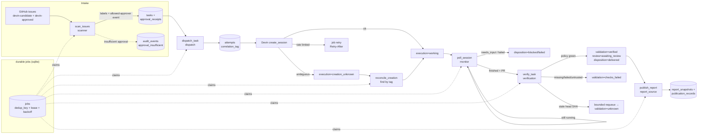

# Devin Repair Desk — architecture (milestone A)

One application process: FastAPI serves the read-only dashboard API + built
frontend and owns a single asynchronous background worker that claims durable
jobs from SQLite. No in-memory queues — every unit of work is a row, so a
restart loses nothing.

## Components

- **`app/main.py`** — ASGI app factory. Lifespan loads config (fail-closed),
  opens SQLite, starts the one worker task, serves `frontend/dist`.
- **`app/config.py`** — the tutorial §10.4 contract. `APP_MODE` selects the
  client set; missing/unknown mode or incomplete live config refuses to start.
- **`app/db.py`** — schema + connection helpers. WAL, `BEGIN IMMEDIATE`
  transactions, savepoint nesting. Tables: `tasks`, `approval_receipts`,
  `attempts`, `jobs`, `evidence`, `audit_events`, `report_snapshots`,
  `publication_records`, `control`, plus `sim_*` fixture tables (simulation).
- **`app/states.py`** — the PRD's four task dimensions and the legal
  transition map; `app/transitions.py` enforces it and writes audit events.
- **`app/services/`** — job handlers: `scanner` (intake + approval receipt),
  `dispatch` (persist intent → create session → poll), `monitor` (poll →
  execution dimension), `verification` (independent check-run verification
  under the versioned YAML policy), `reporting` + `report_source`
  (deterministic snapshots → fixed report-source issue), `worker`
  (claim/lease/recover), `jobs` (durable queue), `simulator` (scenario seeds).
- **`app/clients/`** — `base.py` protocols; `fakes.py` drives everything from
  `sim_*` tables (no sockets); `github.py`/`devin.py` are live shells where
  reads raise `LiveReadsNotImplemented` and writes `ExternalWriteDisabled`;
  `factory.py` selects by `APP_MODE` — anything else raises.
- **`app/cli.py`** — `doctor`, `simulate`, `tasks`, `reports`, `pause`,
  `unpause`, `export-evidence`. Never starts a worker.
- **`frontend/`** — React/TS dashboard: mode badge, pause flag, metrics, task
  table with the four dimensions, per-task evidence/audit drawer, report
  snapshots, scenario launcher (simulation only).
- **`config/verification.yaml`** — versioned verification policy: expected
  check names, trusted workflow provenance, head-SHA freshness, re-verify cap.

## Orchestration flow

## State dimensions

Each task tracks four independent dimensions — one flat status cannot express
"agent finished but checks failed" or "verified but unreviewed".

- **execution**: queued → dispatching → working → needs_input /
  approval_required / suspended / agent_finished / failed / stopped;
  creation_unknown reconciles back into working.
- **validation**: no_pr → pr_found → checks_pending → verified /
  checks_failed / unknown. An empty check list is never success.
- **review**: unknown → awaiting_review → changes_requested / approved →
  merged / closed_unmerged.
- **disposition**: active → delivered / blocked / failed / cancelled.

## Live vs simulation

`APP_MODE` fails closed: unknown or missing values refuse startup, and live
mode requires every §10.4 variable to be present and non-placeholder. Each
mode uses its own `DATABASE_PATH` and compose project (`repairdesk-sim` /
`repairdesk-live` volumes), and every row carries `mode`; synthetic records
are flagged `synthetic` and labelled in the UI/exports.

## Failure containment (PRD F-series highlights)

- Dispatch persists the correlation tag **before** calling Devin; ambiguous
  creation → `creation_unknown` → reconcile by tag (never blind retry).
- Polling preserves unfamiliar statuses instead of forcing failure/success.
- Verification independently re-fetches PR head SHA; stale/missing/failed/
  untrusted checks never verify.
- Report publication failure never changes the remediation outcome; records
  carry confirmed/unknown/failed status with observed body hash.
- Pause blocks new dispatch only — polling, verification and reporting
  continue.
